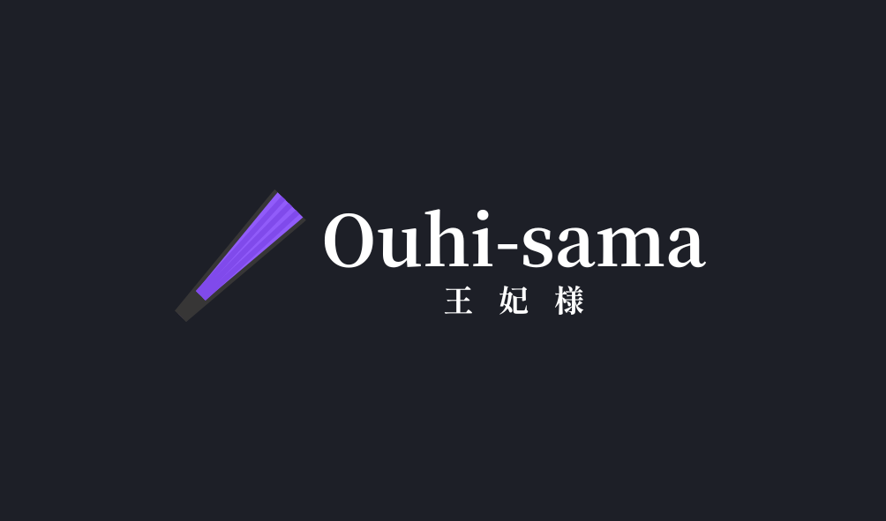

# Ouhi-sama 王妃様 - Todos

Ouhi-sama wa programming language desu.

Hopefully we won't get too many todos and they won't get forgotten. If you've got any ideas to help out, please let us know by creating an issue or a pull request.

---

- [x] Replace `Printf` with `Sprintf` in the token debugging function in `pkg/tokeniser/token.go` and all other related stuff. (Proposed by [@uynilo9](https://github.com/uynilo9) on 24-10-11; completed by [@uynilo9](https://github.com/uynilo9) on 24-10-22)

- [ ] Add a workflow for building the Ouhi-sama program (`cmd/ouhisama/ouhisama.go`). (Proposed by [@uynilo9](https://github.com/uynilo9) on 24-10-11)

- [ ] Correct the misused binding power argument in the function `ledHandler` under `parseExpression` (`pkg/parser/expressions.go`). (Proposed by [@uynilo9](https://github.com/uynilo9) on 24-11-1)

- [ ] Remove the useless parameter `bp` in the function `nullDenotation` (`pkg/parser/expressions.go`). (Proposed by [@uynilo9](https://github.com/uynilo9) on 24-11-1)
